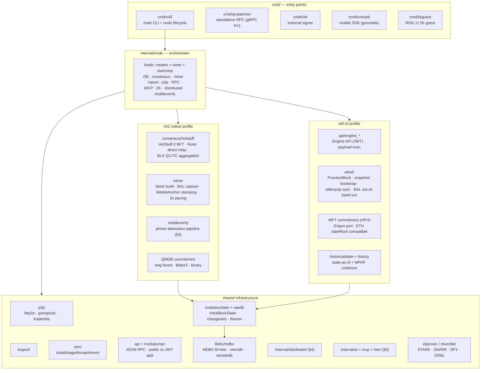
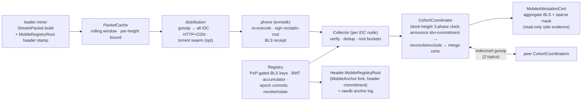

# N42 Module Map

One-page functional map of the repository: what each module does and how the
pieces wire together at runtime. Complements `CLAUDE.md` (which carries the
full directory reference); this document is the picture.

## 1. Dual-architecture overview

N42 ships one binary that runs in two mutually exclusive profiles:

- **n42 native** (`--profile n42`) — the self-sovereign chain: HotStuff-2 BFT
  consensus, QMDB state commitment, mobile attestation, block interval pacing.
- **eth-el** (`--profile` eth-el modes) — an Ethereum-compatible execution
  layer: Engine API driven, Ethereum MPT state root (byte-compatible),
  minimal / full / archive data modes.

Both profiles share the node orchestrator, storage, networking and tooling.

## 2. State commitment engines (pluggable `RootComputer`)

| Engine | Library | Shape / hash | Status |
|---|---|---|---|
| **QMDB** | `lib/qmdb` (via modules/state/commitment) | twig forest / binary / Blake3 | **production — n42 native** (`--chain private`, live HotStuff fleet) |
| **MPT (HPH)** | `lib/commitment` | 16-ary / Keccak, Erigon HexPatriciaHashed port | **production — eth-el** (ETH stateRoot byte-compatible) |
| JMT | `lib/jmt` | 16-ary sparse / Blake3 | deprecated as default; legacy named chains only |
| BMT | `lib/bmt` | binary / Blake3, content-addressed | validated (11.7M replay); also the mobileverify registry accumulator |
| Verkle | `lib/verkle` | 256-ary / Bandersnatch IPA | experimental |
| LtHash | `lib/lthash` | homomorphic 2048B digest, treeless | experimental cross-check |

## 3. Mobile attestation pipeline (n42 native)

Phones strengthen verification of committed blocks; they are **never on the
consensus path** (no votes, no quorum influence). Data plane reuses the
production evmsdk `StreamPacket` (down) / 72-byte `VerificationReceipt` (up).

Key invariants: BLS cert merging requires disjoint signer sets (enforced by
pre-aggregation index reconciliation with signature commitments); certs are
verified against the registry at every admission point; the registry never
reuses an index (revoked keys cannot re-register).

## 4. Distributed services (`internal/distributed`)

- **coprocessor** — tiered verification (ZK → optimistic bond+challenge → TEE),
  provider marketplace (stake, reverse auction), verify-or-slash. RPC is
  JWT-only (`coprocessor_*`).
- **compute** — WASM engine (fuel-metered wazero), MapReduce batch, AI
  inference with opML fraud proofs.
- **messaging** — 6-layer stack: gossip relay (8 shards) · X25519/XChaCha20 E2E ·
  RLN anti-spam · CAS persistence · MLS groups · SSE stream + DID identity.
- **storage** — IPFS bridge, BitTorrent bridge (also serves eth-el cold
  segments and mobileverify packet swarm), ed2k (deprecated).
- **notify** — contract events → wallet push streams.

## 5. AI infrastructure

- `internal/ai/wallet` + `coord` — agent wallets (session keys, spend policies,
  paymaster) and agent discovery/negotiation/reputation.
- `internal/ai/governance` / `training` / `attestation` — dataset ethics
  committee, ZK training verification, signed inference attestation chains.
- `internal/vm` `0x0301` — AI inference precompile (wazero-backed).
- `internal/mev` — AI block optimizer + gas predictor (miner-injected).
- `internal/mcp` — MCP server for agent data/task/wallet tools.
- `internal/exex` — execution extensions; AI data indexer.

## 6. EIP-7928 BAL (eth-el)

Producer and importer both harvest per-tx post-writes through `BALCapture`
(pure `StateWriter` observer); the canonical hash is bound into
`Header.BlockAccessListHash` on every build path and re-verified on import.
Full BALs travel out-of-band: rawdb store → devp2p `GetBlockAccessLists
0x12 / BlockAccessLists 0x13` (bounded 256/request) → `VerifyAndPrewarmBAL`
prewarms state before execution. Known gaps (tracked, not yet wired): eth/69
`Length` still 18 so 0x12/0x13 are unreachable on the wire; peer-download
prefetch not injected; storage reads / system calls not captured (phase 1).

## 7. RPC surface

| Endpoint | Port (default) | Namespaces |
|---|---|---|
| public HTTP / WS | 20012 / 20013 | eth, web3, net, txpool, debug/trace, mobileverify, n42 |
| authenticated (JWT) | 20014 | engine, coprocessor, hotstuff admin (+ everything) |
| MCP (AI agents) | 8553 | data / agent / wallet tools |
| SSE message stream | 8554 | /ws/messages |
| gRPC KV | 9090 | remote KV for rpcdaemon |

Public endpoints register **only** unauthenticated APIs; `Authenticated: true`
namespaces exist solely behind JWT and in-process.
